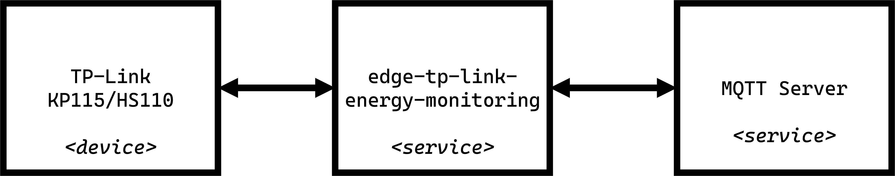
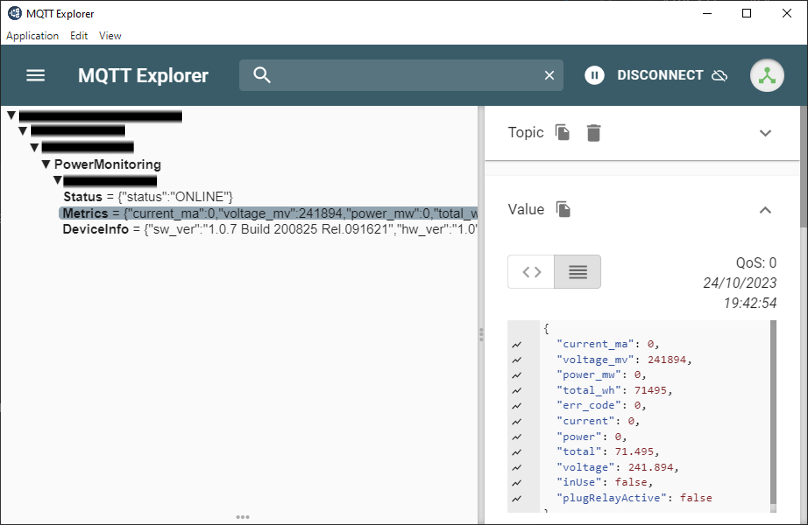

## Overview of `edge-tp-link-energy-monitoring`
Service for collecting data from TP-Link energy monitoring smart plugs (such as HS110 or KP115) and forwarding data to an MQTT server.



## Configuration
Update the [config.json](./config/config.json.example) file in `/app/config/config.json`:

```json
{
  "mqtt": {
    "host": "<server_ip>",
    "port": 1883,
    "username": "",
    "password": "",
    "base_topic": "<Site>/EnergyMonitoring"
  },
    "deviceAddresses": [
    "tplink-01",
    "tplink-02"
  ]
}
```

## Practical Example

